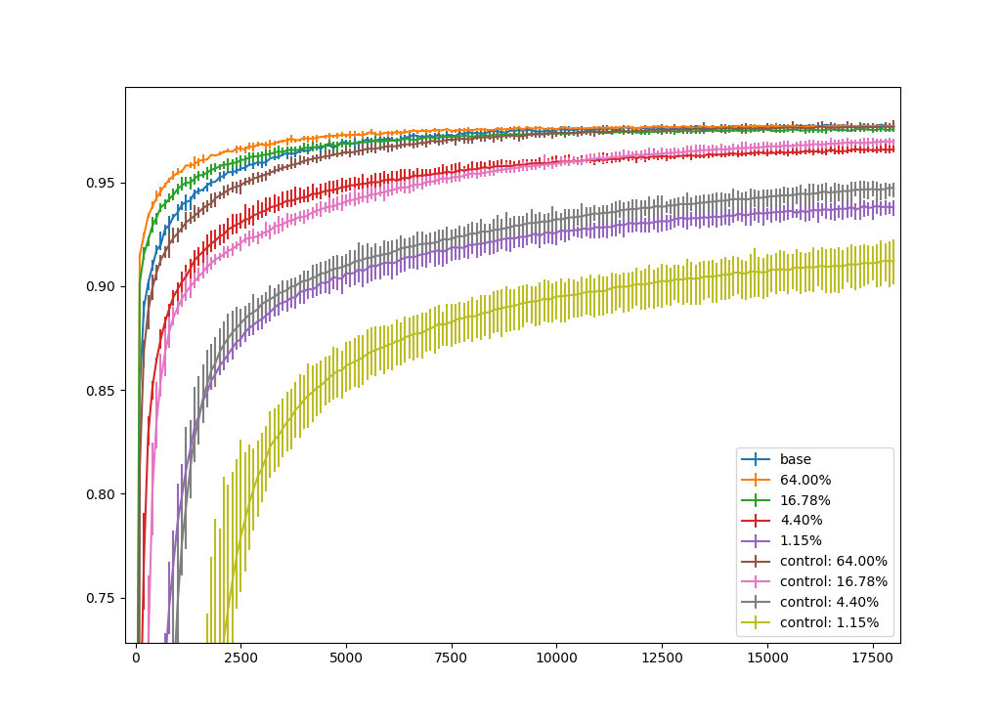
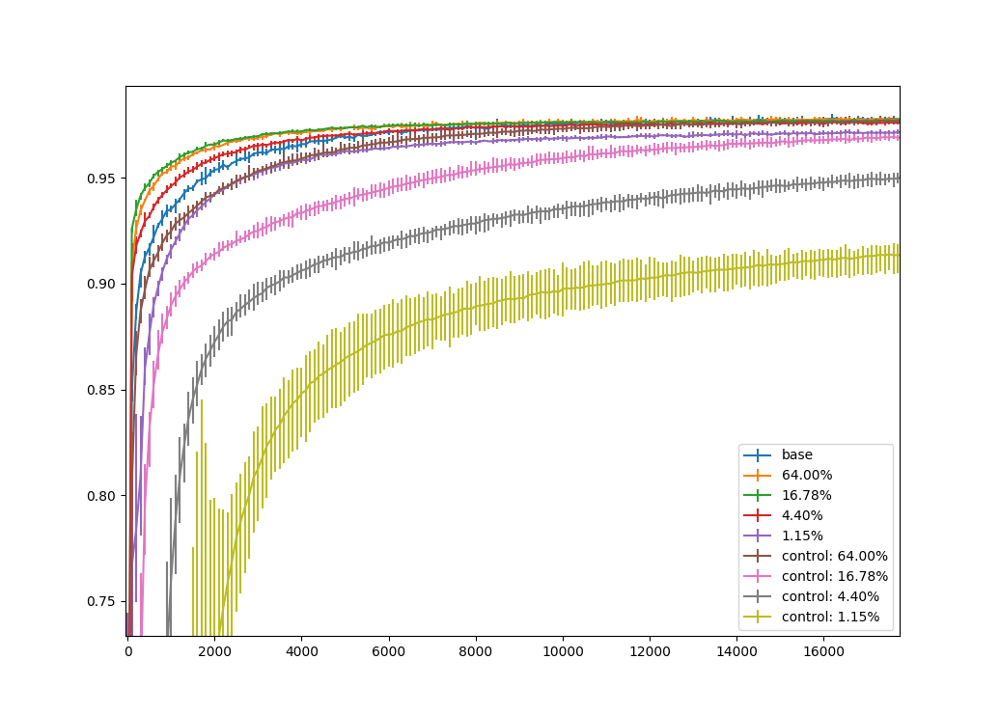

This is an implementation of the methods used in The Lottery Ticket Hypothesis: Training Pruned Neural Networks by Jonathan Frankle and Michael Carbin [1].

## How to run the experiment yourself

### Run an experiment with

> python3 algorithm.py --resultdir {path to directory}

#### Other options:

> --iterative
Defaults to true. Define if the iterative or the one shot method should be used to find lottery tickets.

> --samplestart
Defaults to 0. With which sample index to start. Useful if you want to run all samples completely seperated for parallelization.

> --samplesupremum
Defaults to 5. Like above. One above last Sample index to work on.

> --reductionsteps
Defaults to 10. How often the weight matrices get pruned. How many times to prune to 64% of weights.

> --trainingsteps
Defaults to 18000. How many steps to take during training. This number should be chosen such that one can assume gradient descent is converged.

#### Example:

> mkdir results
> python3 algorithm.py --resultdir results --iterative false --samplestart 0 --samplesupremum 3

This will make the directory *results*. And then safe the one shot results of samples 0 to 2 in *results*.

## How to plot the results:

### Plot with
> python3 plot.py --resultdir {path to directory}

#### Other options:

> --samplestart
Defaults to 0. With which sample index to start.

> --samplesupremum
Defaults to 5. Like above. One above last Sample index to work on.

> --reductionsteps
Defaults to 10. How often the weight matrices get pruned. How many times to prune to 64% of weights.

#### Example:

> python3 plot.py --resultdir results

## Results
I have very similar results to what was published in the paper[1].

### Results for One Shot Pruning

In this graph I show test accuracy of pruned lottery tickets after number of training steps, compared to test tickets. In test tickets I reinitilialized all weights, only preserving the structure of the winning tickets. This

### Results for Iterative Pruning

In this graph I show test accuracy of pruned lottery tickets after number of training steps, compared to test tickets. In test tickets I reinitilialized all weights, only preserving the structure of the winning tickets. This

